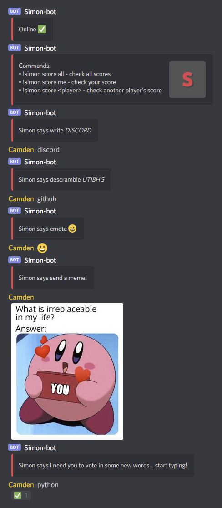

# Simon Says

## Synopsis:
This is a Discord bot minigame written in Python to simulate the childhood game of Simon says... but with a twist!  
Instead of touching your noise... you write words, descramble words, send emoticons, and more for points!  
By default, a new prompt occurs every 30 minutes. Enjoy!

## Requirements:
* [Python 3.6+](https://www.python.org/)
* [Discord Library](https://pypi.org/project/discord.py/) - *pip install discord*
* On [Windows](https://www.codegrepper.com/code-examples/whatever/discord+ssl+certificate+error) and [Mac](https://pastebin.com/8Cs0C8c4) install a Discord certificate

## Usage:
* Put your Discord bot token into Token.txt
* Add more words to Random.txt to be selected from (optional)

## Example:

## Support:
* Windows :heavy_check_mark:
* Linux: :heavy_check_mark:
* Mac: :heavy_check_mark:
